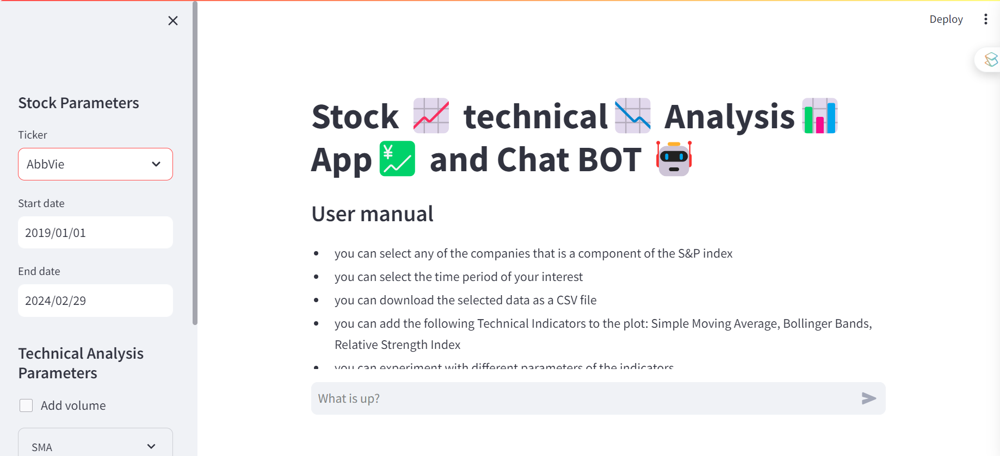
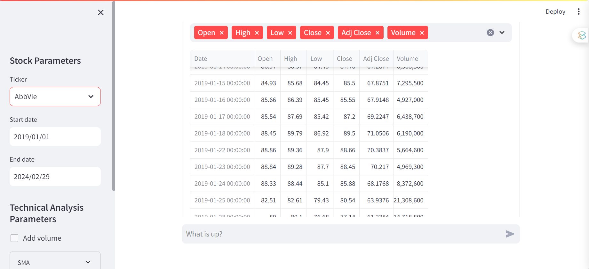
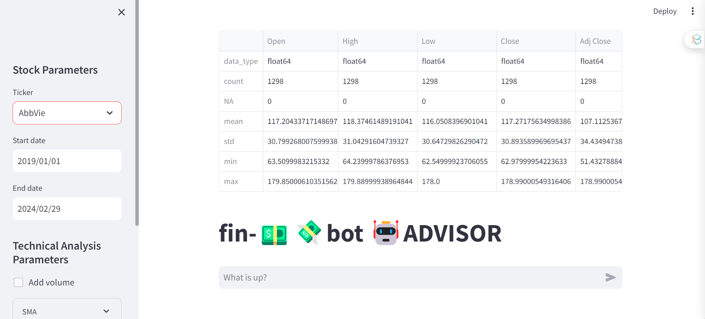
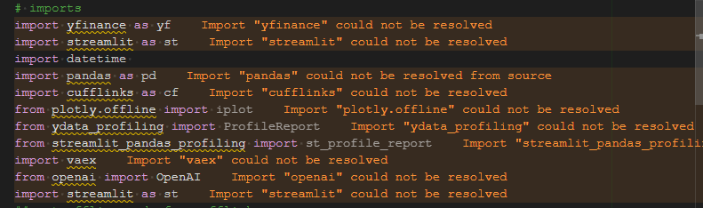
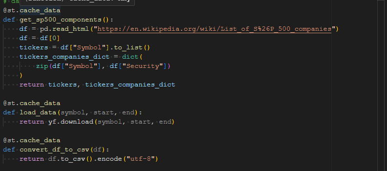

# stockanalyserandbot

This is a Streamlit application for performing technical analysis on stock data. It uses several libraries including yfinance for downloading historical market data from Yahoo finance, pandas for data manipulation, cufflinks for interactive plots, and vaex for efficient data processing.

The application allows the user to select a stock from the S&P 500 index, specify a date range, and add various technical indicators to the plot such as Simple Moving Average (SMA), Bollinger Bands, and Relative Strength Index (RSI). The user can also download the selected data as a CSV file.

In addition, the application includes a chatbot powered by OpenAI's GPT-3.5-turbo model, which can answer user's queries in a conversational manner.

Here's a breakdown of the main parts of the code:

Imports: The necessary Python libraries are imported.

Data Functions: Three functions are defined to get the S&P 500 components, load the data for a specific stock, and convert a DataFrame to a CSV file. These functions are decorated with @st.cache_data to enable caching, which can significantly speed up the app by storing the results of long-running computations.

Sidebar Inputs: The sidebar of the app includes several inputs that allow the user to specify the parameters for downloading the data and performing the technical analysis.

Main Body: The main body of the app includes a title, a user manual, a data preview section, a technical analysis plot, and a data profiling report. The data profiling report is generated using Vaex's describe method, which provides basic statistics for each column in the DataFrame.

Chatbot: The chatbot is powered by OpenAI's GPT-3.5-turbo model. The user can type a message in the chat input, and the chatbot will respond in a conversational manner. The messages are stored in the session